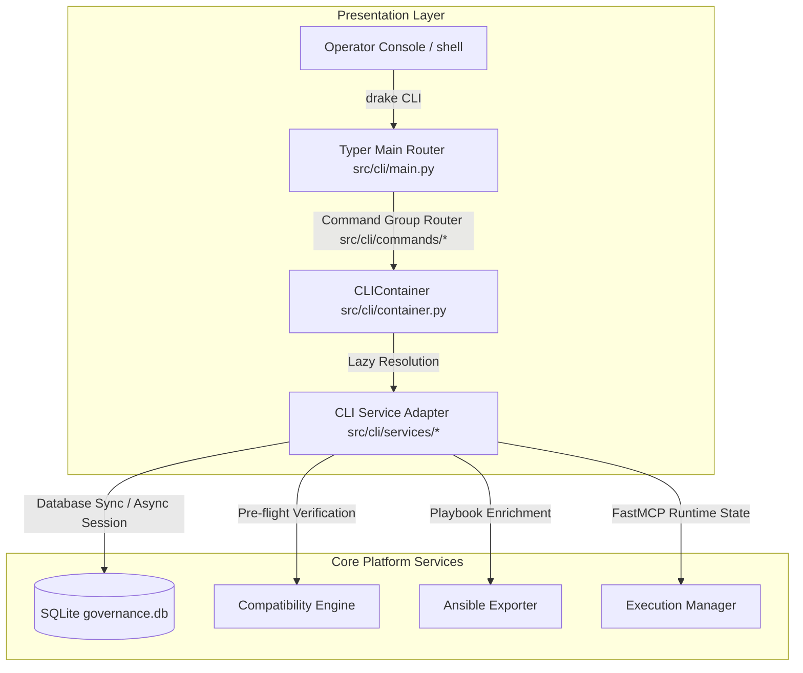

# Dell Enterprise MCP Proxy - Infrastructure Command Center CLI (`drake`)

The **Infrastructure Command Center CLI (`drake`)** is the primary operational control plane and administration utility for the Dell Enterprise MCP Proxy platform. 

It is designed for:
*   **Infrastructure Engineers** managing bare-metal systems and server topologies.
*   **Platform Reliability Engineers (PRE)** monitoring runtime states and API availability.
*   **Dell PowerEdge Administrators** validating hardware compliance and firmware inventories.
*   **Governance & Compliance Teams** auditing AI-generated workflows and reviewing action ledgers.

The CLI acts as a thin presentation and orchestration layer over the underlying Dell MCP services, presenting a high-performance, unified, and resilient command center experience.

---

## 🏛 System Architecture & Data Flow

Drake is built on a highly modular architecture spanning AI ingestion, human-in-the-loop governance, and dynamic proxying.

### 1. Ingestion Phase (AI Clustering)
Raw OpenAPI specification files (like Redfish API definitions) are ingested and semantically parsed. 
* **Graph Theory & LLM Embeddings**: We use `sentence-transformers` and the **Leiden Algorithm** to map endpoints as nodes in a graph and group them into logical "workflows".
* **Automated Naming**: The `ollama_service` assigns human-readable titles (e.g., *Dell Power Supply Management*) to these clustered workflows.

### 2. Governance Phase (Policy Engine & HITL)
Once workflows are generated, they enter the `governance` layer.
* **AST Policy Parsing**: Workflows are evaluated against rules defined in `policy.yaml` (such as blocking bulk destructive operations).
* **Human-in-the-loop (HITL)**: Administrators must use the CLI (`drake governance review`) or the Web Console to manually approve or reject workflows before the AI agent can use them.

### 3. Runtime Phase (FastMCP Proxy)
* **Dynamic Tool Injection**: The `FastMCP` FastAPI backend reads only the *approved* workflows from the SQLite database and dynamically generates callable MCP Python tools on-the-fly.
* **SSE Connections**: The interactive AI Agent connects via Server-Sent Events (SSE) to orchestrate infrastructure securely.



---

## 🛡️ Security & Execution Guardrails

To prevent the LLM from making accidental or malicious infrastructure changes, Drake implements robust runtime guardrails located in `src/drake/governance/middleware.py`.

* **Campaign Tracker**: Tracks the AI Agent's sequence of actions within a rolling time window. If the agent repeatedly attempts suspicious operations (e.g., executing multiple destructive `DELETE` HTTP requests on bare-metal hardware), the Campaign Tracker detects the anomaly and hard-blocks the agent.
* **Evasion & Obfuscation Blocking**: Intercepts LLM attempts to bypass logging or mask its true operational intent.
* **Policy Engine Engine (`policy.yaml`)**:
  * `AutoApproveLowRisk`: Approves highly-confident safe workflows.
  * `BlockDestructiveBulk`: Flags or denies bulk endpoints containing destructive methods.
  * `RequireApprovalForHighRisk`: Forces manual review for system-critical modifications.

---

## 📂 Codebase Directory Structure

```text
drake/
├── data/                      # Local SQLite databases (governance.db, mcp_proxy.db)
├── frontend/                  # Next.js Web Governance Dashboard
├── tests/fixtures/            # OpenAPI specifications and mock payloads
├── windows_scripts/           # Windows Launcher Scripts (start.ps1, start.bat)
├── linux_scripts/             # Linux/macOS Launcher Scripts (start.sh, test_all.sh)
└── src/drake/                 # Core Python Backend
    ├── ai_clustering/         # OpenAPI parsing, Leiden graphing, and semantic grouping
    ├── cli/                   # Typer presentation layer and CLI commands
    ├── core/                  # SQLAlchemy models and shared types
    ├── governance/            # AST Policy engine, runtime guardrails, and HITL logic
    ├── parser/                # OpenAPI spec ingestion logic
    └── proxy/                 # FastMCP & FastAPI runtime backend
```

---

## 💻 Next.js Web Governance Console

While the `drake` CLI provides immense terminal power, the platform also includes a robust React/Next.js dashboard (running on `http://localhost:3000`).
* **Visual Workflows**: It hooks directly into the FastAPI backend (`/api/workflows`) to provide a visual interface for the Governance Phase.
* **One-Click Approval**: Operators can visually inspect the exact HTTP methods, API paths, and payloads assigned to a clustered workflow and click "Approve" or "Reject".

---

## 🚀 End-to-End Workflow Tutorial

Follow these steps if this is your first time setting up the platform and you need to ingest a large number of endpoints into the MCP Proxy.

### Step 1: Ingest OpenAPI Specification & Auto-Approve
First, parse your Redfish OpenAPI specification file. The AI Clustering Engine will group hundreds of individual endpoints into logical workflows.
Run the following command to ingest the endpoints. The `--auto-approve` flag triggers the Governance Engine to automatically approve all safe, low-risk workflows based on your `policy.yaml` rules, saving you from manual auditing:
```powershell
# 1. Activate venv (once per terminal session)
.venv\Scripts\Activate.ps1

# 2. Run the ingestion pipeline
drake pipeline tests\fixtures\openapi-7.xx.yaml --auto-approve
```

### Step 2: Verify Governance Status
Once the pipeline finishes, verify how many workflows were successfully approved and if any require manual review (or were denied due to destructive bulk rules):
```powershell
# Check workflows that still require human review
drake governance pending

# Manually approve a specific workflow that was blocked by policy (e.g., HIGH/CRITICAL risk)
drake governance approve <workflow_id>
# Example: drake governance approve wf_c_616cc9a0

# Check workflows that are fully certified and ready for the AI Agent
drake governance approved
```

### Step 3: Launch Platform Services
With the database seeded with approved workflows, launch all local services:
```powershell
# Windows
.\windows_scripts\start.ps1

# Linux / macOS
bash linux_scripts/start.sh
```
When you run this script, it orchestrates the entire stack automatically:
1. **Environment Config**: Verifies your `.env` secrets.
2. **Virtual Environment**: Installs and syncs `uv` Python dependencies.
3. **LLM Engine**: Ensures Ollama is running locally with the target model.
4. **Mock API (Prism)**: Starts a local Mock Redfish server on port `4010` via Docker Compose so the agent can execute real HTTP requests against dummy hardware.
5. **Security Suite**: Runs the AI Guardrails tests to ensure campaign tracking and obfuscation blocks are active.
6. **FastMCP / FastAPI Proxy**: Launches the backend proxy server on port `8001`, which binds to the SQLite database and exposes your approved workflows.
7. **Next.js Console**: Launches the web governance dashboard on port `3000`.

At the end of the script, press **Y** to launch the interactive AI Agent Terminal.

### Step 4: Test the AI Agent
Inside the Drake AI Agent Terminal, the agent will automatically connect to the Proxy and load all approved MCP workflows. 

These test prompts are designed to be intentionally vague and omit required IDs. This tests the AI's ability to semantically map your request to the correct tool, and then halt to ask you for the missing information before executing:

**Test 1: Core System Diagnostics**
* **Prompt:** *"Are you connected to the backend proxy? Give me a status report on the connection."*
* **Expected Tool:** `get_proxy_status`
* **What to expect:** The agent should instantly fire the tool (no params needed).

**Test 2: Power Diagnostics**
* **Prompt:** *"Can you grab the current power metrics and consumption data for my server?"*
* **Expected Tool:** `power_management`
* **What to expect:** The agent should realize it needs to call `power_management`, but recognize it lacks the IDs. It should ask for the `ComputerSystemId` and `ProcessorId` you want to target.

**Test 3: Compatibility Engine**
* **Prompt:** *"I need to run a compatibility check against a target server before we deploy anything to it."*
* **Expected Tool:** `check_workflow_compatibility`
* **What to expect:** The agent should stop and ask you for the specific `workflow_id` and the `target_ip` address.

**Test 4: Thermal Monitoring**
* **Prompt:** *"I'm worried the system might be overheating. Check the thermal sensors and cooling status."*
* **Expected Tool:** `thermal_management` or `thermal_management_1`
* **What to expect:** The agent should attempt to check the thermal state but halt to ask which `ChassisId` or System ID you are referring to.

**Test 5: Complex Nested Management**
* **Prompt:** *"Fetch the current metrics and capabilities for the Fibre Channel network."*
* **Expected Tool:** `dell_f_c_management`
* **What to expect:** The agent should map "Fibre Channel" to the tool, realize it is missing many nested IDs, and prompt you to provide them.

> **Testing Tip:** When the agent replies asking for missing IDs, simply invent dummy IDs (e.g., `System.Embedded.1` or `CPU.1`) and give them back to it to watch it successfully execute the mock tool!

---

## 🤖 AI Agent Terminal (Dual-Mode)

Drake includes an Ollama-powered AI agent that understands natural language and can execute **both** infrastructure workflows and platform admin commands:

```powershell
# Launch via start.ps1 or start.sh (recommended) — choose Y when prompted
.\windows_scripts\start.ps1

# Or launch manually after activating venv
python scripts/interactive_agent.py
```

The agent has **two tool namespaces**:

| Mode | When the LLM uses it | Example prompt |
|---|---|---|
| **CLI** (`cli`) | Platform admin: cluster, govern, audit, diagnose | *"show me pending workflows"* |
| **MCP** (`mcp`) | Infrastructure execution: firmware, config, rollback | *"execute the firmware update workflow"* |

---

## ⚙️ Advanced Usage (Manual Commands)

If you prefer to run commands manually instead of using the AI agent, activate the virtual environment first:

```powershell
# 1. Activate venv (once per terminal session)
.venv\Scripts\Activate.ps1

# 2. Print global help instructions and subcommand catalog
drake --help

# 3. Render the executive control plane dashboard overview
drake overview

# 4. Verify subsystem readiness and health assessment matrix
drake health
```

---

## 📜 Command Reference

The Command Center organizes operational tasks into specialized command groups:

### 1. `cluster`
Manages AI clustering, OpenAPI integrations, and spec parsing.
*   **`summary`** - Render clustering metrics and distribution data.
*   **`graph`** - Display active relationship graphs of endpoints.
*   **`run --spec <path>`** - Parse an OpenAPI specification file and regenerate workflow clusters.

### 2. `governance`
Enforces human-in-the-loop review cycles for LLM-generated workflows.
*   **`pending`** - List all workflows awaiting human approval.
*   **`approved`** - List all certified/approved operational workflows.
*   **`rejected`** - List workflows blocked or rejected by operators.
*   **`review <workflow_id>`** - Inspect a workflow's details and constituent API steps.
*   **`approve <workflow_id>`** - Approve a pending workflow, promoting it to an executable FastMCP tool.
*   **`reject <workflow_id> --reason <text>`** - Reject a workflow and document the audit reason.

### 3. `compatibility`
Pre-flight verification intelligence.
*   **`validate <workflow_id> --target-ip <ip>`** - Validate workflow steps against target hardware.
*   **`explain <workflow_id>`** - Render the DAG rules tree that evaluates the workflow.
*   **`dashboard <workflow_id> --target-ip <ip>`** - Renders the decision cockpit.
*   **`rules`** - Print the active policies and compatibility rules catalog.
*   **`device <ip>`** - Query stateful cached specifications for a datacenter node.

### 4. `runtime`
Controls the FastMCP integration hooks.
*   **`tools`** - List currently exposed FastMCP tools ready for client consumption.
*   **`reload`** - Trigger hot-reloads to refresh tool mappings from database states.
*   **`execute <tool_name> --params <json>`** - Manually invoke a registered workflow.

### 5. `ansible`
Exports workflow logic to infrastructure-as-code files.
*   **`preview <workflow_id>`** - Render syntax-highlighted playbook configurations directly on the console.
*   **`export <workflow_id> --output <path>`** - Export enriched playbooks directly to files.

### 6. `audit`
Exposes the compliance history ledger.
*   **`events`** - List administrative events, modifications, and approvals.
*   **`executions`** - Print workflow runs, durations, status codes, and targets.
*   **`summary`** - Present compliance summaries and error trends.

### 7. `system`
Prints operational topology data.
*   **`topology`** - Display the system dependencies tree.

### 8. `diagnostics`
Evaluates internal health checks.
*   **`db`** / **`api`** / **`compatibility`** / **`runtime`** - Troubleshoot connections to database files, REST endpoints, and facts caches.

---

## ✈️ Flagship Feature: Compatibility Cockpit

The **Compatibility Cockpit** provides a single Go/No-Go verdict before executing any workflow on target hardware:

```bash
drake compatibility dashboard <workflow_id> --target-ip <ip>
```

### Cockpit Panels
1.  **Target Device**: Displays model, BIOS version, Lifecycle Controller version, and scan time.
2.  **Validation Scores**: Compatibility Score, Risk Score, Blast Radius, Confidence.
3.  **Violations**: Lists check failures, expected vs actual properties, and corrective remediation actions.
4.  **Prerequisites Dependencies**: Structured tree showing parent-child dependency checks.
5.  **Final Execution Verdict**: Bold colored indicator marking either `✓ SAFE TO EXECUTE` or `✗ BLOCK EXECUTION`.

---

## 🛠️ Universal JSON Mode
To support scripting, automation pipeline runs, and DevOps integration, every CLI command supports the `--json` flag:
```bash
drake --json compatibility dashboard test_wf_1 --target-ip 192.168.0.120
```

---

## 🔌 Plugin System
The Command Center includes a self-discovering plugin mechanism located in **`src/cli/plugins/`**. The CLI automatically loads modules that do not start with an underscore (`_`) and registers them as subcommands.

---

## ❓ Troubleshooting

*   **Legacy Windows Output Crash (`UnicodeEncodeError`)**: Force the environment to use UTF-8 encoding (`$env:PYTHONIOENCODING="utf-8"`).
*   **Packaging Script Location Error (`ModuleNotFoundError`)**: Activate the `uv` virtual environment before running any commands (`.venv\Scripts\Activate.ps1`).
*   **SQLite Database Locks**: Run `drake diagnostics db` to check connection status. Ensure the microservice FastAPI server is running with WAL journal modes.
