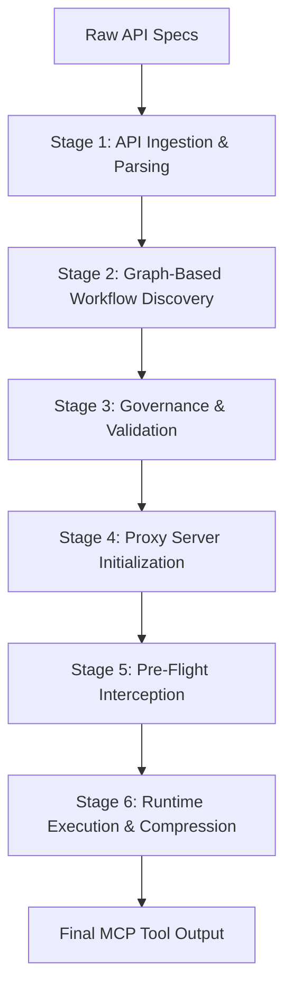

# System Pipeline Architecture Report
**Project:** Dell Enterprise MCP Workflow Proxy
**Scope:** End-to-End Execution Pipeline Discovery

---

## SYSTEM PIPELINE OVERVIEW

The codebase represents a sophisticated 6-stage hybrid pipeline. It merges NLP-based workflow discovery at design-time with deterministic, strictly governed runtime execution. The system serves as an intermediary (Proxy) between an MCP Client (LLMs) and Dell Infrastructure (e.g., iDRAC servers), managing payload compression, tool registration, and execution rollback mechanisms.



| Stage | Name | Responsibility | Core Technology |
| ----- | ---- | -------------- | --------------- |
| 1 | API Ingestion & Parsing | Normalize multi-protocol specs into unified `ContractA`. | Custom Parsers (OpenAPI, GraphQL, etc.) |
| 2 | Graph-Based Workflow Discovery | Group related endpoints into autonomous workflow tools. | NetworkX, Leiden Algorithm, Ollama LLM |
| 3 | Governance & Validation | Enforce structural integrity, cycle detection, and risk policies. | `GovernanceMiddleware`, Policy Engine |
| 4 | Proxy Server Initialization | Dynamically expose workflows as FastMCP tools. | FastMCP, FastAPI, SQLite, inspect |
| 5 | Pre-Flight Interception | Run compatibility checks, audit logging, and evaluate snapshots. | Compatibility Engine, Redfish APIs |
| 6 | Runtime Execution & Compression | Resolve dynamic variables, execute steps, compress payload. | HTTPX, Regex, JSON Parsing |

---

# DETAILED STAGE BREAKDOWN

---

# STAGE 1

API INGESTION & PARSING

Parses heterogeneous API specification formats into a uniform intermediary structure.

## What It Does
* Iterates through a given file path to detect and parse OpenAPI, GraphQL, gRPC, and AsyncAPI specs.
* Flattens massive nested structures into individual endpoint definitions.
* Standardizes endpoint inputs, outputs, and metadata into a unified schema.

## Technology Breakdown
| Technology | Why Used | What It Handles |
| ---------- | -------- | --------------- |
| Custom Parsers (`*Parser`) | Protocol agnosticism. | Extracts `operation_id`, `method`, `url`, `schemas` from various spec formats. |
| `ContractA` Schema | Standardized data structure. | Acts as the universal domain model for the downstream pipeline. |

## Input → Output
| Input | Output |
| ----- | ------ |
| Raw API Spec files (e.g., `openapi.json`, `.proto`, `.graphql`) | Unified `ContractA` object with a list of standardized endpoints. |

## Internal Components
* Classes: `OpenAPIParser`, `GraphQLParser`, `gRPCParser`, `AsyncAPIParser`.
* Functions: `parse_and_flatten()`
* Primary Files: `src/parser/openapi_parser.py`, `src/parser/graphql_parser.py`, `src/parser/grpc_parser.py`, `src/parser/asyncapi_parser.py`

## Runtime Flow
1. CLI triggers ingestion via `src/ai_clustering/ingest_and_cluster.py`.
2. Pipeline detects file extensions and instantiates the correct parser object.
3. Parser executes `parse_and_flatten()` to generate unified endpoints.
4. Endpoints are aggregated into a unified `ContractA` model.

## Key Data Structures
```python
ContractA(
    spec_title="Multi-API",
    spec_version="1.0.0",
    openapi_version="N/A",
    source_file="Multi-API",
    total_endpoints=450,
    endpoints=[...]
)
```

## Failure Handling
* Fallback Mechanisms: If an unknown extension or parsing error occurs, it falls back to the default `OpenAPIParser`. Skips unsupported file extensions with a logger warning.

## Observability
* Standard Python `logging` for file discovery and ingestion stats.
* Outputs metrics in "explain mode" directly to the terminal detailing Paths Found, Operations Found, and Endpoints Extracted.

---

# STAGE 2

GRAPH-BASED WORKFLOW DISCOVERY

Groups isolated, fine-grained endpoints into logical, multi-step workflows.

## What It Does
* Generates embeddings for endpoint metadata to calculate semantic similarity.
* Calculates path matching and tag similarity scores to construct a weighted edge matrix.
* Applies an automatic dynamic "Goldilocks Zone" threshold to filter weak edges.
* Uses the Leiden algorithm to detect isolated communities.
* Queries local LLMs (Ollama) to assign human-readable semantic labels and descriptions.

## Technology Breakdown
| Technology | Why Used | What It Handles |
| ---------- | -------- | --------------- |
| NetworkX | Graph structure representation. | Stores nodes (endpoints) and edges (similarities). |
| igraph & leidenalg | Unsupervised clustering. | Detects densely connected communities. |
| NumPy | Vectorized mathematics. | Accelerates massive Jaccard similarity and prefix matching matrix operations. |
| Ollama | Semantic naming. | Generates concise workflow titles and descriptions using Map-Reduce. |

## Input → Output
| Input | Output |
| ----- | ------ |
| List of `ContractA` endpoints | Communities of endpoints forming workflows (`ContractB`). |

## Internal Components
* Functions: `build_relationship_graph`, `detect_communities`, `generate_semantic_label`, `run_pipeline`.
* Primary Files: `src/ai_clustering/graph_clustering.py`, `src/ai_clustering/embedding_service.py`, `src/ai_clustering/ollama_service.py`

## Runtime Flow
1. `EmbeddingService` computes a semantic similarity matrix.
2. Vectorized operations calculate tag and path similarity, merging them into a final weight matrix.
3. NetworkX builds the graph using the top edges above a dynamically calculated threshold.
4. `leidenalg` partitions the graph into communities.
5. Ollama processes each community using Map-Reduce to generate a `system_name` and `display_name`.
6. Generated workflows are passed down the pipeline for persistence.

## Key Data Structures
A NetworkX `Graph` where nodes represent endpoints and edges carry a `weight` attribute representing composite similarity scores.

## Failure Handling
* If `leidenalg` fails to import or errors out, it falls back to assigning each node to its own isolated community.
* If `Ollama` is unreachable or generation fails, it uses heuristic fallbacks (e.g., checking for Write methods to label it "Management").

## Observability
* Diagnostic "Explain Mode" that prints community cohesion scores, graph validation histograms, and detailed edge acceptance rates.

---

# STAGE 3

GOVERNANCE & VALIDATION

Ensures the newly discovered workflows are structurally sound and compliant with risk policies before persistence.

## What It Does
* Validates parameter mappings between steps.
* Assesses the risk of a workflow based on HTTP methods (e.g., DELETE = critical risk).
* Injects policy evaluation (e.g., strict blocking vs warn-only).
* Updates the workflow status (Pending, Auto-Approved, Denied) directly before insertion into SQLite.

## Technology Breakdown
| Technology | Why Used | What It Handles |
| ---------- | -------- | --------------- |
| Custom Rule Engine | Compliance. | Evaluates risk profiles against configured policies. |
| SQLite (`sqlite3` / `SQLAlchemy`) | Persistence. | Stores the final governed state and schema definitions. |

## Input → Output
| Input | Output |
| ----- | ------ |
| Unvalidated workflows and endpoints | Policy-enriched, scored workflows (persisted to `governance.db`). |

## Internal Components
* Classes: `GovernanceMiddleware`, `PolicyEngine`, `RiskAssessor`, `WorkflowValidator`.
* Primary Files: `src/governance/middleware.py`, `src/core/database.py`

## Runtime Flow
1. `save_workflows()` in `database.py` is invoked.
2. It calls `GovernanceMiddleware.process_new_workflows()`.
3. The Validator runs structural checks.
4. RiskAssessor calculates a risk level and score.
5. PolicyEngine evaluates the risk and sets the `approved` state.
6. The enriched workflow is inserted into the `workflows` table.

## Key Data Structures
Workflow records enriched with `risk_level`, `risk_score`, `governance_score`, `policy_version`, and `approved` status.

## Failure Handling
* Workflows failing validation are marked with `approved=2` (Rejected) and provided a `rejection_reason`.

## Observability
* Uses Python `logging` to track middleware interception and state transitions.

---

# STAGE 4

PROXY SERVER INITIALIZATION

Bootstraps the FastAPI/FastMCP server and dynamically exposes approved workflows as executable MCP tools.

## What It Does
* Syncs the design-time `governance.db` to the runtime `mcp_proxy.db` (if required).
* Queries the SQLite database for workflows with `approved=1`.
* Translates the database steps into Python function signatures dynamically using `inspect.Signature`.
* Registers these dynamic functions to the FastMCP server instance.

## Technology Breakdown
| Technology | Why Used | What It Handles |
| ---------- | -------- | --------------- |
| FastMCP | Agentic Standard. | Translates Python functions into JSON-RPC tools for LLMs. |
| `inspect.Signature` | Dynamic function creation. | Builds parameter schemas required by the MCP server. |
| SQLAlchemy (async) | Modern DB interactions. | Non-blocking database queries at runtime. |

## Input → Output
| Input | Output |
| ----- | ------ |
| Approved SQLite `Workflow` records | Registered `mcp.tool` endpoints. |

## Internal Components
* Functions: `load_approved_tools_from_db`, `lifespan` context manager.
* Primary Files: `src/proxy/server.py`

## Runtime Flow
1. FastAPI app starts, triggering the `lifespan` manager.
2. Calls `load_approved_tools_from_db()`.
3. Iterates over approved workflows, extracting parameters from JSON schemas.
4. Uses `inspect.Parameter` to construct a dynamic tool.
5. Registers the tool via `mcp.add_tool()`.

## Key Data Structures
Dynamic `kwargs` dictionaries mapping to the combined JSON schemas of all underlying workflow steps.

## Failure Handling
* Gracefully skips parameters or schemas that fail JSON deserialization.

## Observability
* Logs dynamic tool registration along with the extracted parameter signature.

---

# STAGE 5

PRE-FLIGHT INTERCEPTION

The core safety mechanism acting immediately before a tool physically touches the network.

## What It Does
* Intercepts execution via `execute_workflow_route`.
* Invokes the Governance layer to apply runtime policy overrides and mask sensitive parameters.
* Delegates to `WorkflowExecutionManager` to query target device facts.
* Evaluates structural compatibility against baseline rules.
* Logs execution attempts to the `audit_events` ledger using cryptographic hashing.

## Technology Breakdown
| Technology | Why Used | What It Handles |
| ---------- | -------- | --------------- |
| SQLAlchemy | Auditing. | Securely logs tampered-evident audit trails. |
| Compatibility Engine | Infrastructure Safety. | Verifies the target server's state against the workflow requirements. |

## Input → Output
| Input | Output |
| ----- | ------ |
| Tool Invocation Request (with kwargs) | Vetted execution context, or an immediate `CallToolResult` error block. |

## Internal Components
* Classes: `WorkflowExecutionManager`, `CompatibilityEngine`, `GovernanceMiddleware`.
* Primary Files: `src/proxy/server.py`, `src/governance/middleware.py`, `src/core/compatibility/orchestrator.py`

## Runtime Flow
1. MCP tool is called. Routes to `execute_workflow_route`.
2. `GovernanceMiddleware.intercept_execution` masks inputs.
3. An `EXECUTION_START` audit event is logged.
4. `WorkflowExecutionManager.execute_workflow_with_validation` handles rule validation.
5. Control is handed over to the specific executor (e.g., `httpx_executor`).

## Key Data Structures
Cryptographically hashed `audit_events` rows tracking the entire lifecycle of the request.

## Failure Handling
* If pre-flight checks fail (e.g., incompatible server model), an exception is caught and wrapped in a formatted `CallToolResult(isError=True)`, ensuring the LLM is informed.
* Updates the Workflow's `last_execution_status` to "FAILED".

## Observability
* Immutable audit ledger (`log_audit_event`) with SHA-256 hash chaining.

---

# STAGE 6

RUNTIME EXECUTION & COMPRESSION

Handles actual external HTTP requests, resolving dynamic variables, and compressing the response.

## What It Does
* Executes workflows iteratively across the target API endpoint.
* Applies a "State-Aware Universal Rollback Architecture" via Redfish SCP XML exports or Dual-Bank partitions (tracked in `revert_previous_action`).
* Formats the response, stripping out redundant HATEOAS links and `@odata` noise to protect the LLM context window.

## Technology Breakdown
| Technology | Why Used | What It Handles |
| ---------- | -------- | --------------- |
| httpx | Async HTTP Client. | Dispatches network requests to target infrastructure. |
| Dell OMSDK / Prism | Target Interfaces. | The physical or mocked targets receiving the HTTP payloads. |

## Input → Output
| Input | Output |
| ----- | ------ |
| Cleared workflow context and parameters | A dictionary containing the final execution response (compressed). |

## Internal Components
* Classes: `PrismExecutor`, `MockExecutor`, `DellOMSDKExecutor`.
* Functions: `revert_previous_action`.
* Primary Files: `src/proxy/executors/*.py`, `src/proxy/server.py`

## Runtime Flow
1. Target Executor authenticates.
2. Iterates over steps.
3. (Not explicitly visible in `server.py` but implied) Executes network calls.
4. Returns result.
5. Proxy server updates the `ExecutionHistory` ledger to "SUCCESS".
6. FastMCP returns the final result dict back to the LLM.

## Key Data Structures
* `ExecutionHistory` table: Tracks `target_server_ip`, `workflow_id`, and `snapshot_path`.

## Failure Handling
* Wraps execution in `try-except`. Catches runtime execution failures, logs an `EXECUTION_FAILED` event, and returns the traceback safely to the LLM.

## Observability
* Final database updates on the `Workflow` table for `execution_count` and `last_execution_status`.

---

# END-TO-END EXECUTION TRACE

**Scenario:** LLM invokes an MCP tool to execute `update_bios_config` on an iDRAC server.

| Step | Stage | Component | Technology | Action |
| ---- | ----- | --------- | ---------- | ------ |
| 1 | Stage 4 | `FastMCP` | WebSockets/stdio | Receives RPC call to execute workflow `update_bios_config`. |
| 2 | Stage 5 | `execute_workflow_route` | Proxy Logic | Intercepts call, extracts policy overrides. |
| 3 | Stage 5 | `GovernanceMiddleware` | Proxy Logic | Masks parameters, checks runtime block rules. |
| 4 | Stage 5 | SQLite | `database.py` | Logs `EXECUTION_START` audit event with SHA-256 hash. |
| 5 | Stage 5 | `WorkflowExecutionManager`| Compatibility Engine| Fetches target Redfish facts. Validates safe execution. |
| 6 | Stage 6 | `DellOMSDKExecutor` | `httpx` | Executes HTTP API commands against the target server. |
| 7 | Stage 6 | SQLite | SQLAlchemy | Commits execution count and status to `Workflow` table. |
| 8 | Stage 6 | SQLite | `database.py` | Logs `EXECUTION_COMPLETE` audit event. |
| 9 | Stage 4 | `FastMCP` | JSON-RPC | Returns final result back to the LLM. |

---

# DEPENDENCY FLOW ANALYSIS

* **`ai_clustering`** module relies heavily on `core.models.ContractA` and `core.database`. It has external dependencies on `networkx`, `igraph`, `leidenalg`, and the `Ollama` API.
* **`governance`** sits directly between the generation phase and the persistence layer, establishing a hard gate.
* **`proxy.server`** depends on `FastMCP`, `SQLAlchemy`, and routing to `core.compatibility` and `proxy.executors`.
* **Database Contention Risks:** Both the asynchronous runtime (`async_sessionmaker`) and the synchronous initialization code (`get_db_connection()`) access the identical SQLite file (`governance.db` / `mcp_proxy.db`). High concurrency during execution history writes could encounter WAL locks if not properly managed. 
* **Circular Dependencies:** Avoided strictly. Business logic calls down to `core.database`, but database definitions remain decoupled from runtime behaviors.

---

# ARCHITECTURE SUMMARY

## Architectural Style
**Pipeline & Intercepting Filter Hybrid.**
The system operates as a data pipeline at design-time (Ingest -> Cluster -> Persist) and an Intercepting Filter/Hexagonal Architecture at runtime (Client -> MCP Proxy -> Governance Interceptors -> HTTP Executors -> Target Server).

## Strengths
1. **Intelligent Modularity:** Separating design-time clustering from runtime execution guarantees that heavy LLM operations (Ollama) do not block real-time API performance.
2. **Robust Auditing:** Tamper-evident hash-chaining in the SQLite database provides enterprise-grade compliance logs.
3. **Safety First:** The multi-layered governance (Pre-Persistence Policy Engine + Runtime Compatibility Checks + Rollback Support) heavily minimizes the Blast Radius of autonomous agents.

## Weaknesses
1. **SQLite Concurrency:** Relying heavily on SQLite for simultaneous runtime auditing and massive ingestion storage can lead to `database is locked` exceptions under heavy asynchronous load, despite WAL mode.
2. **Executor Coupling:** The dynamic tools are generated using JSON schemas but heavily rely on the Executor implementations strictly respecting the `workflow.input` mapping context.

## Scalability Analysis
* **Horizontal Scaling:** The Proxy Server layer is stateless regarding requests (relying entirely on the shared SQLite database). Migrating from SQLite to PostgreSQL would unlock instantaneous horizontal scalability for the Proxy tier.
* **Clustering Scale:** Vectorized similarity calculations using NumPy allow the clustering pipeline to scale efficiently to thousands of endpoints.

## Maintainability Analysis
* Code structure is clearly segregated by domain (`parser`, `ai_clustering`, `governance`, `proxy`).
* Extensive use of Pydantic and type hints simplifies the maintenance of complex data flows.

## Extension Points
* **Ingestion:** Implementing new protocols requires only extending the base Parser class and outputting the standard `ContractA` model.
* **Executors:** Adding support for diverse hardware arrays requires creating a new subclass of the Base Executor.

## Security Considerations
* **Parameter Masking:** `GovernanceMiddleware` masks sensitive inputs before writing to the audit ledger.
* **Tamper-Evident Logs:** The `audit_events` table utilizes a cryptographic hash chain (`previous_hash`) to ensure log integrity.
* **Injection Safety:** The dynamic execution framework avoids unsafe `eval()`, using native `inspect.Signature` and dictionary-based variable resolution to prevent payload injections.
